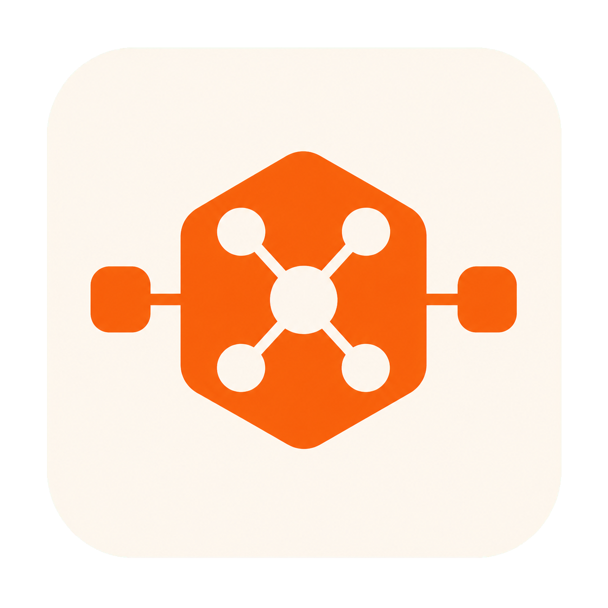

# GPTSwitch

<p align="center">
  
</p>

面向 macOS Codex App 与第三方 Responses API 中转站的原生生图兼容工具。GPTSwitch 通过本地 API 路由切换，让只支持 Responses 托管生图的中转站兼容新版 Codex Images API。

新版 Codex 会调用独立的 `POST /images/generations`，部分中转站只支持 Responses API 托管 `image_generation`，因此会返回 `404`。本工具在 Mac 本机启动一个原生 Swift 代理，自动完成 Images API 与 Responses API 之间的转换。

- 不替换 Codex CLI，不修改 Codex.app。
- Codex 升级后无需重新打补丁。
- 只监听 `127.0.0.1`，不会暴露到局域网或公网。
- 不保存、不打印 API Token 和请求正文。
- 不依赖 Python 或其他运行时。

## 安装 App

从 [GitHub Releases](https://github.com/aluan/codex-fix-patch/releases/latest) 下载最新版 DMG 或 ZIP：

1. 将 `GPTSwitch.app` 拖入“应用程序”。
2. 首次启动后，点击菜单栏图标并打开“设置”。
3. 确认 Provider、上游地址、桥接模型和端口，点击“应用并启动”。
4. 按 `Command + Q` 完全退出 Codex，再重新打开。无需重启电脑。

当前 GitHub 包使用 ad-hoc 签名，尚未经过 Apple 公证。如果 macOS 阻止首次打开，可在 Finder 中右键 App 选择“打开”；仍被阻止时运行：

```bash
xattr -dr com.apple.quarantine "/Applications/GPTSwitch.app"
open "/Applications/GPTSwitch.app"
```

GPTSwitch 是菜单栏工具，不显示 Dock 图标。启用代理后会自动注册登录启动，也可以在设置中关闭。

## 使用

菜单栏提供以下操作：

- 通过状态栏中的 GPTSwitch 单色 Logo 颜色查看代理运行状态。
- 打开管理中心，添加、编辑、复制、排序和快速切换第三方 Provider。
- 对 Provider 执行端点测速与真实模型自检。
- 查看 24 小时、7 天和 30 天请求、Token、延迟与估算成本统计。
- 启动本地代理，或停用代理并恢复原上游地址。
- 运行一次真实生图自检。
- 打开设置和运行日志。

Provider 的 API Key 只保存在 macOS 钥匙串中。代理会在请求发往上游前注入密钥，数据库、日志和 Codex 配置中不会保存由 GPTSwitch 管理的 Key。

自检图片保存在：

```text
~/.codex/generated_images/proxy-self-test/
```

原生 App 状态保存在：

```text
~/Library/Application Support/CodexImageGenProxy/state.json
```

`state.json` 仅用于保存代理安装与原始上游地址，确保停用时可以安全恢复；Provider、定价和请求统计保存在同目录的 `gptswitch.sqlite3`。统计只记录 Provider、模型、状态码、Token 和耗时等元数据，不保存 Prompt 或响应正文。

首次升级到支持多 Provider 的版本时，GPTSwitch 会扫描 `~/.codex/config.toml` 中的全部 `[model_providers.*]` 配置。可读取的 API Key 会迁移到 macOS 钥匙串，原 Codex 配置保持不变；无法取得密钥的 Provider 会保留配置并提示补录。

## Codex 升级

Codex App 升级后不需要同步更新本工具。本工具不再替换 Codex 自带 CLI，只在本机处理 HTTP API 协议。

只有未来 OpenAI 修改 Images API 或 Responses `image_generation` 协议时，才可能需要升级本工具。普通 Codex App 版本更新不会影响代理。

## 工作原理

启用时，App 会备份 `~/.codex/config.toml`，只把当前 Provider 的 `base_url` 改为同路径的本机地址，例如：

```text
https://relay.example/api
          ↓
http://127.0.0.1:17891/api
```

本地代理会：

1. 将 `/responses`、`/models` 等普通请求透明转发到原中转站。
2. 将 `/images/generations` 和 `/images/edits` 转为 Responses 托管 `image_generation`。
3. 将返回图片重新封装为 Images API 响应，交给 Codex 保存和展示。

停用时，仅当当前 `base_url` 仍指向本代理，App 才会自动恢复原地址，避免覆盖之后的手工修改。

## 从旧版迁移

如果安装过 `v1.1.0` Python 代理，GPTSwitch 首次启动时会自动：

1. 导入旧状态和端口配置。
2. 停止并移除旧 LaunchAgent。
3. 清除旧 `CODEX_CLI_PATH` 环境变量。
4. 在原生代理成功监听后删除旧 Python 运行文件。

Codex 的 `base_url` 会保持不变，迁移过程中无需重新配置 Token。

如果正在从 `v1.2.0` 的 `Codex ImageGen Proxy.app` 升级，GPTSwitch 会自动刷新登录项到新 App 路径。确认 GPTSwitch 正常运行后，可以删除旧名称的 App。

## 旧版命令行安装器

没有使用原生 App 时，仍可把 Python 版作为兼容后备：

```bash
./install-codex-imagegen-patch.sh
./install-codex-imagegen-patch.sh --status
./install-codex-imagegen-patch.sh --test-image
./install-codex-imagegen-patch.sh --uninstall
```

原生 App 与 Python 版不要同时运行在同一个端口。推荐只使用原生 App。

## 开发

要求 macOS 14+、Xcode 26+ 和 [XcodeGen](https://github.com/yonaskolb/XcodeGen)：

```bash
brew install xcodegen
swift script/generate_brand_assets.swift
./script/build_and_run.sh --verify
xcodebuild test \
  -project CodexImageGenProxy.xcodeproj \
  -scheme CodexImageGenProxy \
  -derivedDataPath .build/DerivedData \
  CODE_SIGNING_ALLOWED=NO
./script/package_app.sh
```

原生实现位于 `App/`，测试位于 `AppTests/`。Python 代理和原安装器保留为 legacy fallback。

## 当前限制

- 上游需支持 HTTP Responses API 和托管 `image_generation` 工具。
- 普通 Responses WebSocket 不经过本代理转换。
- `images/edits` 的实际编辑能力取决于中转站实现。
- 当前公开包为 ad-hoc 签名；Developer ID 签名与公证将在后续版本提供。

## 相关上游

- [PR #31596: Use the image generation extension by default](https://github.com/openai/codex/pull/31596)
- [Issue #30921: Custom GPT endpoint cannot use Imagen](https://github.com/openai/codex/issues/30921)
